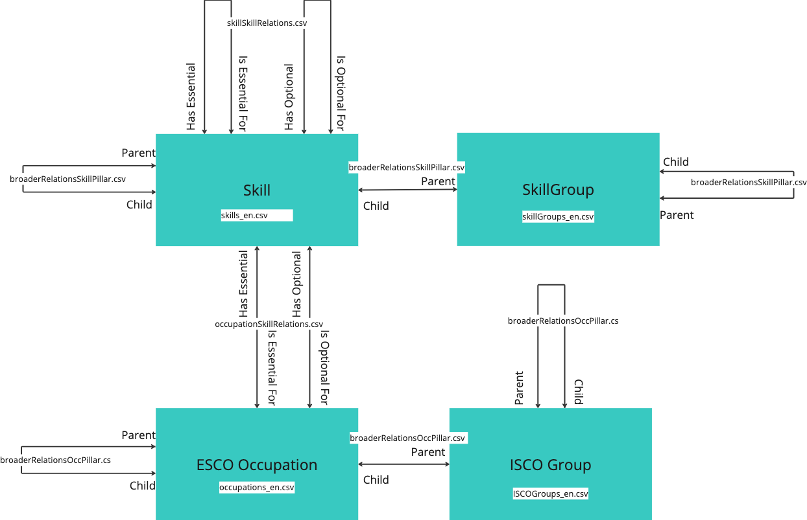

# ESCO Meta Model 

The meta-model in the image bellow describes the structure of the ESCO classification system. It depicts the four entities (ISCO Groups, Skill Groups, Skills and Occupations) anδ their associations. It also and in which files they can be found.  

